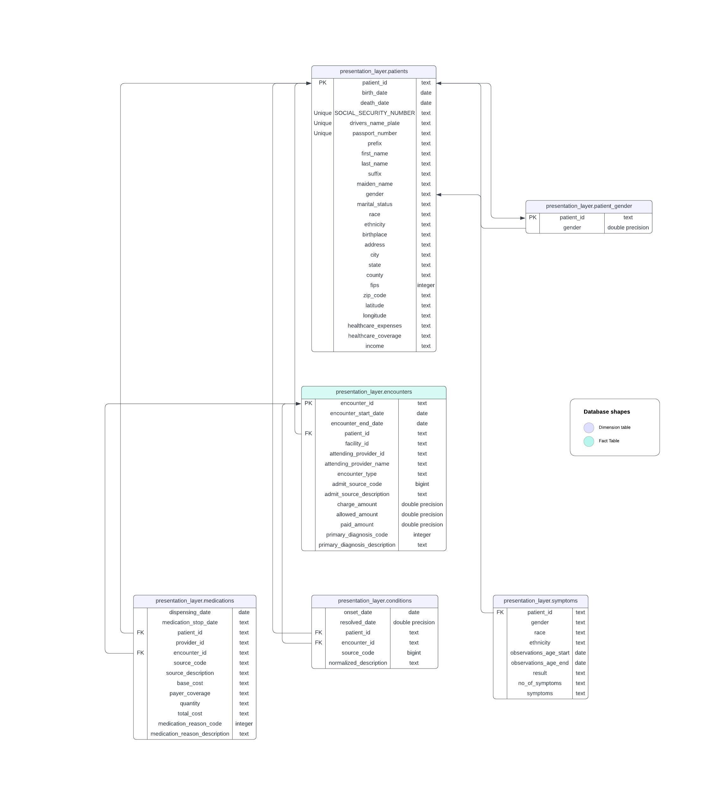
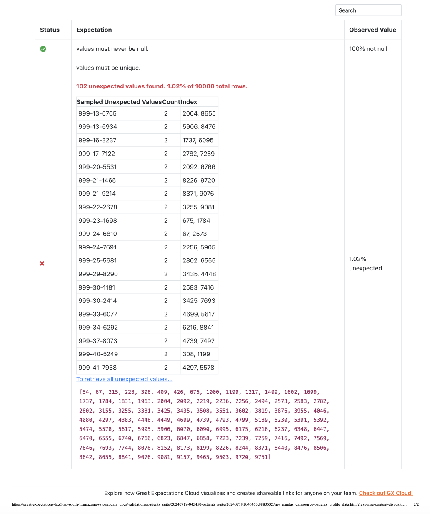
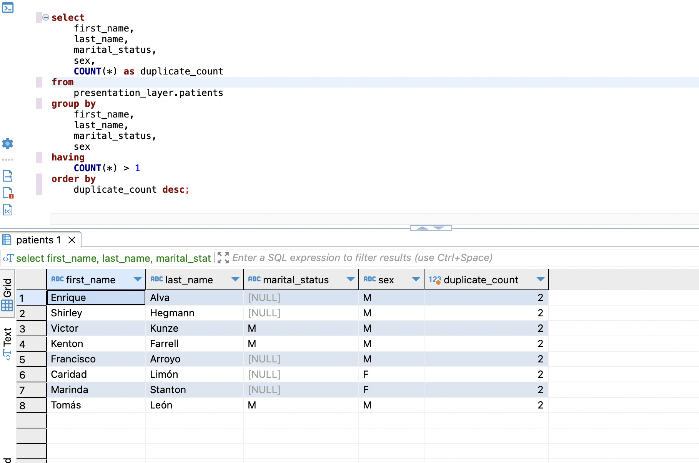
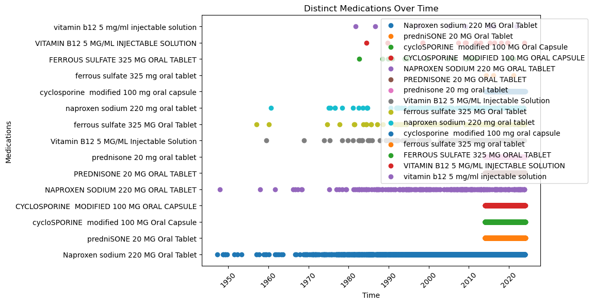
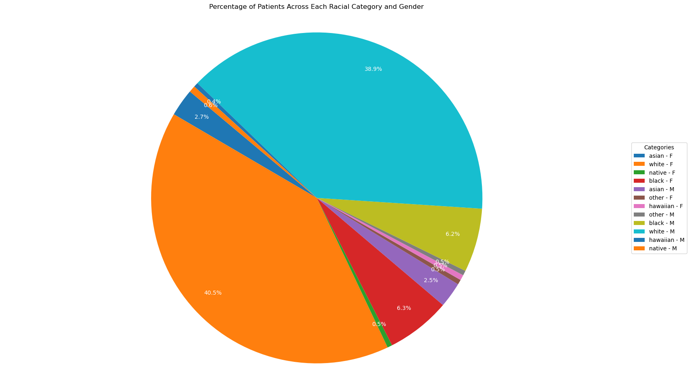

# Data Engineering Project: Healthcare Data Integration

## Overview

This project integrates and analyzes healthcare data to create a comprehensive dataset for further analysis. The datasets involved include patient records, conditions, medications, symptoms, encounters, and gender information. The integration aims to create a wide table that consolidates all relevant information for each patient, providing a robust dataset for downstream analytics.

## ER Diagram

  
*Figure 1: Entity-Relationship Diagram of the Healthcare Data Integration Project*

The ER diagram illustrates the relationships between the various datasets used in this project. Key entities include `Patients`, `Conditions`, `Medications`, `Symptoms`, `Encounters`, and `Patient_Gender`. The diagram highlights how these entities are linked through common identifiers such as `patient_id` and `encounter_id`, providing a clear view of the data structure and integration points.

## Datasets

1. **Patients Dataset (`patients_df`)**
   - Contains patient demographic information including IDs, birthdates, social security numbers, names, race, ethnicity, and contact details.

   - **Data Quality Issues:**
     - **Duplicates:** Found and removed 8 duplicate records.
       - **Inconsistent Data:** `first_name`, `last_name`, and `maiden_name` columns contained random numbers which were cleaned using regex replacement.
       - **FIPS Data Type:** `FIPS` column was initially in float format and was cast to integer.
       - **Social Security Number:** Detected non-unique Social Security Numbers for 102 patients, which should have been unique. This was identified through a data quality check using Great Expectations.
        Great expectations data docs result: 

**Additional data quality checks performed on the `patients` dataset using Great Expectations** 
* Please refer great_expectations/ directory to see the expectations_suite and checkpoint config
* **PATIENT_ID Column**
   - **Check for Non-Null Values:** Ensures that the `PATIENT_ID` column does not contain any null values.
   - **Uniqueness:** Verifies that each `PATIENT_ID` is unique across the dataset.
* **SSN Column**
   - **Check for Non-Null Values:** Ensures that the `SSN` (Social Security Number) column does not contain any null values.
   - **Uniqueness:** Verifies that each `SSN` is unique across the dataset, which is crucial as SSNs should be unique for each individual.
* **PASSPORT Column**
   - **Uniqueness:** Verifies that each `PASSPORT` number is unique across the dataset.


2. **Conditions Dataset (`conditions_df`)**
   - Records medical conditions experienced by patients, including onset and resolved dates, source codes, and descriptions.

3. **Medications Dataset (`medications_df`)**
   - Details medications prescribed to patients, including dispensing dates, stop dates, source codes, descriptions, costs, quantities, and reason codes.

4. **Symptoms Dataset (`symptoms_df`)**
   - Captures symptoms reported by patients, along with demographic details, symptom counts, and descriptions.

5. **Encounters Dataset (`encounters_df`)**
   - Includes information about patient encounters with healthcare providers, such as start and end dates, facility IDs, provider IDs, encounter types, and cost details.

6. **Patient Gender Dataset (`patients_gender_df`)**
   - Provides gender information for patients, linked by `patient_id`.

**Transformations for all datasets:**
- **Column Name Standardization:** Standardized column names for consistency and integration.
- **UUID Standardization:** Ensured was in lower case to match with other datasets.


## Data Analysis

1. **How many distinct patients are in the dataset?**

   We used an SQL query to identify duplicate records based on the combination of `first_name`, `last_name`, `marital_status`, and `sex`. Out of 10,000 records, we found 8 duplicate records.

   - **Observations**: The presence of duplicate records, 8 out of 10,000
   - **Result**: 9,992 distinct records
   - **Result Image**: 


2. **Plot the distinct medications over time**

   We plot the distinct medications administered over time to observe trends.

   - **Plot**: 
     - **Code**: 
     ```
              import pandas as pd
              medications_path = 'medications.csv'
              patients_path = 'patients.csv'
              medications_df = pd.read_csv(medications_path)
              patients_df = pd.read_csv(patients_path)
            
              medications_duplicates = medications_df.duplicated()
              duplicate_count = medications_duplicates.sum()
              clean_medications_df = medications_df.drop_duplicates()
              clean_duplicate_count = clean_medications_df.duplicated().sum()
              duplicate_count, clean_duplicate_count
            
              import matplotlib.pyplot as plt
            
              clean_medications_df['START'] = pd.to_datetime(clean_medications_df['START'])
              clean_medications_df['STOP'] = pd.to_datetime(clean_medications_df['STOP'])
            
              medication_times = clean_medications_df[['START', 'DESCRIPTION']]
            
              plt.figure(figsize=(12, 6))
              for medication in medication_times['DESCRIPTION'].unique():
                  times = medication_times[medication_times['DESCRIPTION'] == medication]['START']
                  plt.scatter(times, [medication] * len(times), label=medication)
            
              plt.xlabel('Time')
              plt.ylabel('Medications')
              plt.title('Distinct Medications Over Time')
              plt.legend(loc='upper right', bbox_to_anchor=(1.15, 1))
              plt.xticks(rotation=45)
              plt.tight_layout()
              plt.show()

3. **Create a pie chart indicating the percentage of patients across each racial category and gender**

   A pie chart is created to visualize the distribution of patients by racial category and gender, along with dataframe.

      - **Code**: 
   ```import matplotlib.pyplot as plt
    grouped_data = patients_df.groupBy("race", "sex").agg(f.count("*").alias("count"))
    
    total_count = grouped_data.agg({"count": "sum"}).collect()[0][0] - 8   # To remove duplicates
    
    grouped_data = grouped_data.withColumn("percentage", (f.col("count") / total_count) * 100)
    grouped_data.show()
    
    data = grouped_data.collect()
    
    categories = [f"{row['race']} - {row['sex']}" for row in data]
    percentages = [row['percentage'] for row in data]
    
    plt.figure(figsize=(10, 8))
    plt.pie(percentages, labels=categories, autopct='%1.1f%%', startangle=140)
    plt.axis('equal')
    plt.title("Percentage of Patients Across Each Racial Category and Gender")
    plt.show()``` 

- **Dataframe**: 
      
                     +--------+---+-----+-------------------+
                     |    race|sex|count|         percentage|
                     +--------+---+-----+-------------------+
                     |   asian|  F|  268| 2.6821457165732587|
                     |   white|  F| 4047|  40.50240192153723|
                     |  native|  F|   47|0.47037630104083267|
                     |   black|  F|  628|  6.285028022417935|
                     |   asian|  M|  247| 2.4719775820656524|
                     |   other|  F|   48| 0.4803843074459567|
                     |hawaiian|  F|   52| 0.5204163330664532|
                     |   other|  M|   47|0.47037630104083267|
                     |   black|  M|  623|  6.234987990392314|
                     |   white|  M| 3885|  38.88110488390713|
                     |hawaiian|  M|   44| 0.4403522818254604|
                     |  native|  M|   64| 0.6405124099279423|
                     +--------+---+-----+-------------------+


  - **Pie Chart**: 

4. **What percentage of patients have all 4 symptom categories ≥ 30?**

   We calculate the percentage of patients who have recorded all four symptom categories with counts greater than or equal to 30.

   - **Result**: 0%. None of the patients in the dataset have all 4 symptom categories ≥ 30


## Setup and Usage

To run this project, ensure you have the following prerequisites:
- Apache Spark (Along with necessary JAR files and integrations for connectors)
- PySpark
- Matplotlib (for plotting)
- Airflow
- Great expectations

